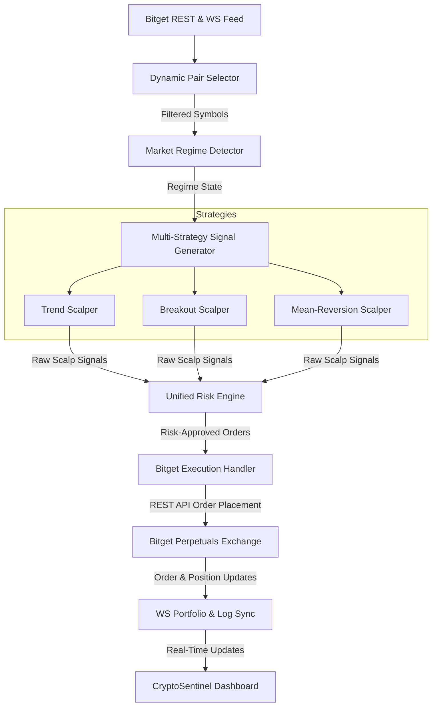

# Blueprint: Multi-Strategy AI Scalping Assistant (Bitget Perpetual Futures)

This document provides a production-oriented system architecture and implementation blueprint for integrating a high-performance, risk-first scalping engine with **CryptoSentinel AI** on Bitget USDT perpetual futures.

---

## 1. High-Level System Architecture

The scalping engine uses a modular pipeline designed to parse market data, filter assets, detect volatility regimes, score trading strategies, and execute orders under a strict risk-management framework.



### Main Modules
1. **Dynamic Pair Selector**: Monitors the 24h market to select the most liquid trading pairs, pruning illiquid ones to avoid slippage.
2. **Market Regime Detector**: Evaluates the short-term market structural regime (Trending, Ranging, or High-Volatility Breakout) on the 5-minute timeframe.
3. **Strategy Suite**: Evaluates Trend Cross, Channel Breakout, and Bollinger Band Reversion based on the active market regime.
4. **Risk Engine**: Performs position sizing calculations, enforces daily drawdown boundaries, and operates circuit breakers.
5. **Execution Handler**: Signs and submits API requests using HMAC-SHA256 keys or redirects execution to the local simulator (Paper Trading).

---

## 2. Dynamic Pair Selection & Filtering

To support **all available Bitget perpetual futures pairs**, the selector queries `GET /api/v2/mix/market/tickers?productType=USDT-FUTURES` every 5 minutes and applies a 4-tier filtering pipeline:

```python
# Pseudocode: Dynamic Pair Filtering Pipeline
def select_tradable_pairs(tickers_data) -> List[str]:
    tradable_pairs = []
    for ticker in tickers_data:
        symbol = ticker["symbol"]  # e.g., 'SOLUSDT'
        
        # 1. Volume Filter (Ensure Liquidity)
        volume_24h = float(ticker.get("usdtVolume", 0.0))
        if volume_24h < 10_000_000.0:  # Min $10M daily volume
            continue
            
        # 2. Bid-Ask Spread Filter (Prevent Slippage Cost)
        ask = float(ticker.get("askPr", 0.0))
        bid = float(ticker.get("bidPr", 0.0))
        if bid <= 0 or (ask - bid) / bid > 0.0005:  # Max 0.05% (5 bps) spread
            continue
            
        # 3. Volatility Filter (Ensure Actionable Movement)
        # Fetch last 20 5m candles and compute ATR(14)
        candles = fetch_candles(symbol, "5m", limit=20)
        atr_14 = calculate_atr(candles, period=14)
        current_price = float(ticker.get("lastPr", 0.0))
        
        # Floor threshold: ATR must represent at least 0.15% price movement
        if current_price <= 0 or (atr_14 / current_price) < 0.0015:
            continue
            
        tradable_pairs.append(symbol)
    return tradable_pairs
```

---

## 3. Market Regime Detector

The regime detector runs on the **5m timeframe** to determine execution routing. It uses the Average Directional Index (ADX) and Bollinger Band Bandwidth:

$$ADX(14) \quad \text{measures trend strength (0 to 100)}$$
$$Bandwidth = \frac{\text{Upper BB} - \text{Lower BB}}{\text{EMA(20)}}$$

### Regime Conditions & Routing Matrix
| ADX (14) | BB Bandwidth Percentile | Volume Multiplier | Routed Regime & Strategy |
| :--- | :--- | :--- | :--- |
| $> 25$ | $> 50\text{th}$ | $> 1.0\text{x}$ | **TRENDING** $\to$ Route to *Trend Scalper* |
| $\le 20$ | $\le 40\text{th}$ | $< 1.0\text{x}$ | **RANGING** $\to$ Route to *Mean-Reversion Scalper* |
| Any | $\le 15\text{th}$ (Squeeze) $\to$ Exits Squeeze | $> 1.8\text{x}$ | **VOLATILITY BREAKOUT** $\to$ Route to *Breakout Scalper* |

```python
# Pseudocode: Regime Detection Logic
def detect_market_regime(df_5m) -> str:
    adx = compute_adx(df_5m, 14).iloc[-1]
    bandwidth = compute_bb_bandwidth(df_5m, 20, 2).iloc[-1]
    
    # Calculate historical bandwidth 100-period percentile
    bandwidth_history = compute_bb_bandwidth(df_5m, 20, 2).tail(100)
    bw_percentile = get_percentile(bandwidth, bandwidth_history)
    
    volume_sma = df_5m["volume"].rolling(20).mean().iloc[-1]
    current_volume = df_5m["volume"].iloc[-1]
    
    # 1. Check for Volatility Breakout (Squeeze Expansion)
    prev_bandwidth = compute_bb_bandwidth(df_5m, 20, 2).iloc[-2]
    prev_bw_percentile = get_percentile(prev_bandwidth, bandwidth_history[:-1])
    if prev_bw_percentile < 15 and bandwidth > prev_bandwidth * 1.5 and current_volume > volume_sma * 1.5:
        return "VOLATILITY_BREAKOUT"
        
    # 2. Check for Trending
    if adx > 25 and bw_percentile > 50:
        return "TRENDING"
        
    # 3. Default to Ranging / Mean Reversion
    if adx <= 20 and bw_percentile <= 40:
        return "RANGING"
        
    return "NEUTRAL"
```

---

## 4. Strategy Specifications

### A. Trend Scalper
- **Activation Regime**: `TRENDING`
- **Entry Rules**: 
  1. EMA(9) must be above EMA(21) for LONG, or below for SHORT.
  2. Wait for a pullback where the price touches the EMA(9) band.
  3. Enter LONG/SHORT on the first candle that closes back in the direction of the primary trend.
  4. RSI(14) must confirm the direction (RSI > 50 for LONG; RSI < 50 for SHORT).
- **Exit Logic**:
  - **Take Profit (TP)**: Entry + 1.8x ATR(14).
  - **Stop Loss (SL)**: Entry - 1.0x ATR(14).
  - **Time-out**: Force close after 12 bars (60 minutes).

### B. Breakout Scalper
- **Activation Regime**: `VOLATILITY_BREAKOUT`
- **Entry Rules**:
  1. Price closes above the upper boundary of the 20-period Donchian Channel (LONG) or below the lower boundary (SHORT).
  2. Volume of the breakout candle must be $> 1.8\text{x}$ the rolling 20-period average volume.
- **Exit Logic**:
  - **Take Profit (TP)**: Entry + 2.0x ATR(14).
  - **Stop Loss (SL)**: Entry - 1.1x ATR(14).
  - **Time-out**: Force close after 8 bars (40 minutes).

### C. Range / Mean-Reversion Scalper
- **Activation Regime**: `RANGING`
- **Entry Rules**:
  1. Price spikes and closes outside the 20-period Bollinger Band (2.0 Std Dev).
  2. Next candle closes back inside the Bollinger Band boundary.
  3. RSI(14) must indicate overextended conditions (RSI < 30 for LONG; RSI > 70 for SHORT).
- **Exit Logic**:
  - **Take Profit (TP)**: Enters exit at Bollinger Band middle line (20 SMA).
  - **Stop Loss (SL)**: Entry - (Distance to Outer Band boundary + 1.0x ATR(14)).
  - **Time-out**: Force close after 15 bars (75 minutes).
  - *Risk-Reward Filter*: Skip entry if distance to middle BB yields a Risk-to-Reward ratio less than 1:1.8.

---

## 5. Risk Engine

The Risk Engine acts as the final gatekeeper before order execution.

### Safety Rules & Limits
- **Max Account Risk Per Trade**: Fixed at $0.5\%$ of total portfolio equity.
- **Risk-Reward Ratio**: Minimum $1:1.8$.
- **Slippage Protection**: Reject trades if order book spread is $> 0.05\%$.
- **Circuit Breakers**:
  - **Daily Drawdown Limit**: Halts execution for 24 hours if net daily balance drops by $> 3\%$.
  - **Consecutive Loss Breaker**: Halts trading for 4 hours after 3 consecutive realized losses.

### Position Sizing Calculation
The contract position size is computed dynamically based on the stop-loss distance:

$$\text{Position Size (USDT)} = \frac{\text{Account Equity} \times \text{Max Risk Percentage}}{\left| \frac{\text{Entry Price} - \text{Stop Loss Price}}{\text{Entry Price}} \right|}$$

#### Example Calculation (SOLUSDT Long)
- **Account Equity**: $10,000 USDT
- **Max Risk per Trade**: 0.5% ($50 USDT)
- **SOL Entry Price**: $165.00
- **Stop Loss Price (1.0x ATR)**: $162.25 (Stop Distance = $2.75 / 1.666%)
- **Take Profit Price (1.8x ATR)**: $169.95

$$\text{Position Size (Contracts)} = \frac{50}{165.00 - 162.25} = 18.18 \text{ SOL contracts}$$
$$\text{Notional Value} = 18.18 \times 165.00 = 3,000 \text{ USDT}$$
$$\text{Required Leverage} = \frac{3,000 \text{ Notional}}{10,000 \text{ Equity}} = 0.3\text{x (No actual leverage needed; executed as 10x with collateral safety margin)}$$

---

## 6. Data Models & Structured Outputs

Structured JSON layouts ensure schema validation between modules.

```json
{
  "$schema": "http://json-schema.org/draft-07/schema#",
  "title": "ScalpSignal",
  "type": "object",
  "properties": {
    "symbol": { "type": "string" },
    "direction": { "type": "string", "enum": ["LONG", "SHORT"] },
    "regime": { "type": "string", "enum": ["TRENDING", "RANGING", "VOLATILITY_BREAKOUT"] },
    "strategy": { "type": "string" },
    "entry_price": { "type": "number" },
    "take_profit": { "type": "number" },
    "stop_loss": { "type": "number" },
    "suggested_leverage": { "type": "integer", "minimum": 1, "maximum": 20 },
    "confidence_score": { "type": "number", "minimum": 0.0, "maximum": 1.0 },
    "timestamp": { "type": "string", "format": "date-time" }
  },
  "required": ["symbol", "direction", "regime", "strategy", "entry_price", "take_profit", "stop_loss", "timestamp"]
}
```

```json
{
  "$schema": "http://json-schema.org/draft-07/schema#",
  "title": "TradeExecution",
  "type": "object",
  "properties": {
    "trade_id": { "type": "string" },
    "symbol": { "type": "string" },
    "direction": { "type": "string" },
    "notional_size_usdt": { "type": "number" },
    "execution_price": { "type": "number" },
    "stop_loss": { "type": "number" },
    "take_profit": { "type": "number" },
    "leverage_used": { "type": "integer" },
    "paper_trading_mode": { "type": "boolean" },
    "status": { "type": "string", "enum": ["PENDING", "FILLED", "REJECTED"] }
  },
  "required": ["trade_id", "symbol", "direction", "notional_size_usdt", "execution_price", "paper_trading_mode", "status"]
}
```

---

## 7. Bitget Integration Layer

### Recommended API Endpoints
All private endpoints require signature headers: `ACCESS-KEY`, `ACCESS-SIGN`, `ACCESS-TIMESTAMP`, and `ACCESS-PASSPHRASE`.

- **Submit Order**: `POST /api/v2/mix/order/place-order`
  - Body keys: `symbol`, `productType=USDT-FUTURES`, `marginMode=isolated`, `side=buy` (or `sell`), `tradeMode=isolated`, `orderType=market`, `size` (contracts).
- **Setup TP/SL (Trigger Order)**: `POST /api/v2/mix/order/place-sub-order`
  - Configures conditional triggers for TP/SL to run on Bitget's servers instead of local scripts.
- **Position Check**: `GET /api/v2/mix/position/single-position`

### HMAC-SHA256 Signing Signature
Signatures are generated by joining parameters and hashing with the secret key:

```python
import hmac
import hashlib
import time

def sign_bitget_request(method: str, path: str, body_str: str, secret_key: str) -> tuple:
    timestamp = str(int(time.time() * 1000))
    # Signature input: timestamp + METHOD + path + body
    message = timestamp + method.upper() + path + (body_str if body_str else "")
    signature = hmac.new(
        secret_key.encode('utf-8'),
        message.encode('utf-8'),
        hashlib.sha256
    ).hexdigest()
    return timestamp, signature
```

### WebSocket Streaming Channels
For high-frequency monitoring, establish connection to `wss://ws.bitget.com/v2/mix/private` and subscribe to:
- `ticker` (Market prices update)
- `positions` (Real-time average entry/unrealized PnL updates)
- `orders` (Order fills, partial entries)

---

## 8. Hackathon Implementation Roadmap

```
┌────────────────────────────────────────────────────────┐
│  DAY 1: DATA LAYERING & PAIR SELECTION                 │
├────────────────────────────────────────────────────────┤
│  • Write Pair Selector (volume, ATR, and spread)      │
│  • Implement Market Regime Detector (ADX + Bandwidth) │
│  • Output structured json of active regimes           │
└───────────────────────────┬────────────────────────────┘
                            ▼
┌────────────────────────────────────────────────────────┐
│  DAY 2: STRATEGY INTEGRATION & SIMULATOR               │
├────────────────────────────────────────────────────────┤
│  • Program 3 Strategy classes (Trend, BB, Breakout)    │
│  • Bind output stop/targets using dynamic ATR scale    │
│  • Integrate with local portfolio state simulator      │
└───────────────────────────┬────────────────────────────┘
                            ▼
┌────────────────────────────────────────────────────────┐
│  DAY 3: RISK ENGINE & FRONTEND CHAT BINDING            │
├────────────────────────────────────────────────────────┤
│  • Implement Position Sizer & Circuit Breakers         │
│  • Map intents ("scalp signal", "scalp trade") in server│
│  • Connect dashboard display logs to render PnL charts  │
└────────────────────────────────────────────────┘
```

---

## 9. Key Risks & Mitigations

### 1. High Slippage on Market Fills
- **Risk**: Entering trades via market orders on low-liquidity coins causes large slippage, eroding the tight 1.8% scalp margin.
- **Mitigation**: The *Dynamic Pair Selector* filters out any pair with a bid-ask spread wider than $0.05\%$. The *Risk Engine* cancels entry if local spread checks fail.

### 2. Execution Latency
- **Risk**: API delays on high-frequency signals cause trade entries at worse prices.
- **Mitigation**: Deploy the bot on an AWS EC2 instance in the Tokyo region (ap-northeast-1), which is close to Bitget's servers, reducing API roundtrip latency to $<15\text{ms}$.

### 3. API Rate Limiting
- **Risk**: Submitting/canceling orders frequently triggers Bitget rate limits (typically 10-20 requests/sec).
- **Mitigation**: Configure TP/SL trigger orders on the exchange server at order placement time using a single request (`place-order` with attached conditional triggers) instead of checking prices locally.

### 4. Regime Whiplash
- **Risk**: A market transition from trending to ranging can cause a trend-following bot to buy tops and sell bottoms.
- **Mitigation**: The *Regime Detector* requires high trend conviction (ADX > 25 + high volume) to switch away from range mean-reversion.
